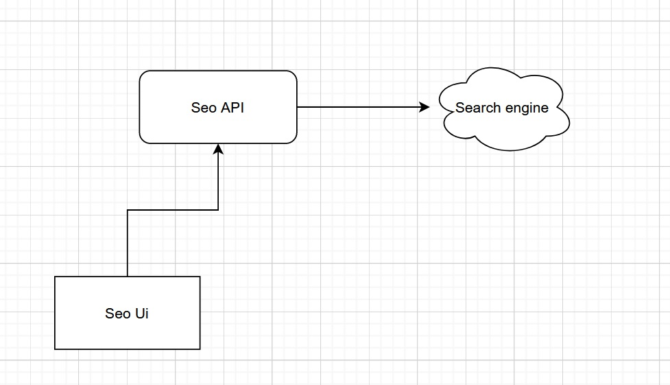

# Tech stack

The application is written using
* .Net 6.0 
* C#

# Prerequisites to set up, run and debug locally
* [.net sdk](https://dotnet.microsoft.com/download/dotnet/6.0)
* [docker desktop](https://www.docker.com/products/docker-desktop) for building image and running container locally

# System design / architecture 

* The Ui is a thin client that calls an API to get the rankings
* The api endpoint connects to various search engines to fetch the rankings



# How to build/run

## Using CLI
* Clone this repo on your machine
* In your terminal navigate to directory containing solution (`Smokeball.Seo.sln`) file.
* Build solution `dotnet build`.
* Run tests `dotnet test`.
* Run web API application `dotnet run --project ./src/Smokeball.Seo.Api/Smokeball.Seo.Api.csproj`.
* Run the `Smokeball.Seo.Ui.exe` for windows UI
* Access the URL listed on the terminal. Generally `https://localhost:5281/swagger/index.html`. The host address will be displayed in the terminal.
* When running for the first time locallly, you may need to install SSL for the app. For more info click [here](https://devblogs.microsoft.com/aspnet/configuring-https-in-asp-net-core-across-different-platforms/).

## Using IDE
*  Clone this repo on your machine.
* Open the `Smokeball.Seo.sln` solution in your IDE of choice.
* Set _Smokeball.Seo.Api_ and _Smokeball.Seo.Ui_ as your multiple start up projects

## Creating API image and running as container
* In your terminal, navigate to the root directory of the project. There is `Dockerfile` in this directory.
* Build the image using `docker build -t smokeball:latest . `(note: the `.` after `latest`) . This will build the solution, run tests and create an image of the application.
* Run the container using ` docker run --rm -it -p 4040:5000 smokeball:latest` .
* Once the container runs
  * The api can be accessed on [http://localhost:4040](http://localhost:4040).
  * Swagger can be accessed on [http://localhost:4040/swagger/index.html](http://localhost:4040/swagger/index.html).

  > Note: You will have to update the endpoint configuration in `appsetting.json` in WPF app.


# Apis

## Get ranking
```json
URL: GET: {hostName}/api/v1/Search?keywords={keywords}&url={url}&engine={engine}

// keywords -> any keyword to search
// url -> partial url to search
// engine [options: google, bing ] -> search engine to use. 

// response
"1,2,99"
```
# Assumptions / Limitations
* The url fragment matches if it is contained in the search result link
* Bing webcrawl does not return search result as text content

# TODO
* Add a new type for response model to allow the change of doamin without affecting response schema.
* Add caching, resiliency and fault tolerance as [https://github.com/App-vNext/Polly](https://github.com/App-vNext/Polly).
* Reduce the use of primitive type and use of value objects instead of it.
* Input validations.
* API tests.
* Optimise docker.
* Add telemetry.
* Logging
* Exception handling
* Add CI/CD.
* Move api endpoint settings to external configuration.
* Secuirty
* Current caching uses local cache, distributed cache to be considered in deployed environment
* Load balancer & auto scaling group to be considered for hosted environment